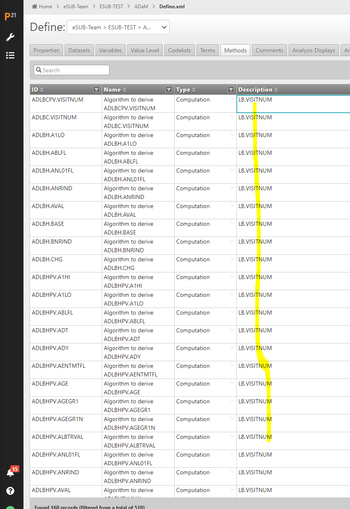

```{r setup, include=FALSE}
knitr::opts_chunk$set(echo = TRUE)
```

Pilot 3 team should be able to see updated meeting minutes here on a
weekly basis.

## 10Feb2023 - Minutes by Robert Devine

-********************************************************************************************-

- Submission Pilot3 - ADaM Check In
- Meeting Organizer: Joel Laxamana
- Participants: Joel Laxamana, Kangjie Zhang, Ben Straub, Steven Haesendonckx, Benjamin Wang, Robert Devine
- Summary: The meeting was conducted with each participant providing an update about their project activities.
- Project Board: https://github.com/orgs/RConsortium/projects/7/views/1
- Resolution: Continue Development (Backlog:14, In Progress:4, In Review: 3, Done: 6)
- Meeting Recorded: Yes

-********************************************************************************************-

- Joel Laxamana - Greetings and Meeting Setup

- Robert Devine - Discussion of recent progress around Issue #5 (ADTTE) and requested to advance the issue from 'In Progress' to 'In Review'. Next Check In follow up with Issue Assignees. Noted participation in the CDISC {admiral} Hackathon (In Progress) with work on ADTTE and other ADaM datasets. Work concurrently on Issue #32.

- Ben Straub - Discussion of focus around PR (Pull Request) => main in reference to the Pilot3 repository
  - Issue #59: Create vignettes for Datasets like Pilot1 did for Tables
  - Issue #58: List out team in Description File
  - Issue #57: Common Issues facing Datasets
  - Issue #55: Establish Rotating Minute Takers Going forward

- Kangjie Zhang - Discussion of the define updates, common issue across datasets, the CDISC {admiral} Hackathon, code quality team awareness, alignment of specs to {admiral} Hackathon. {Thomas Neitmann} has posted the updated spec file in the {admiral} Hackathon Slack channel which was linked during the Check In to Pilot3. The updated spec was posted February 8, 2023 in Slack #admiral_hackathon.

- Joel Laxamana - Discussion of recent progress around ADAE dataset which is now 'In Review'. Requested {Steve Haesendonckx} to review the ADAE dataset which was linked in GitHub by {Ben Straub}.

- Steve Haesendonckx - Discussion of the alternative submission proposal and the R Consortium / R Infrastructure
  - requests to continue alignment with previous R Submission Pilots. The Pilot3 Team indicated interest to possibly revisit the proposal as a Pilot[3.5] at a later date. Noted possible data format differences in ADTTE across the pilots. Accepted request to review the ADAE dataset. Worked with {Nicole Jones} on ADLBC dataset that is 'In Review'.
  
- Benjamin Wang -  Discussion about Issue#5 ADTTE contribution and PR with a request for Comment and Review.
  - Initiated availability to further contribute with additional task assignments. Responded to {Ben Straub} that Issue #29 (Table - Demographics and Baseline Characteristics) would be of interest for assignment in the Project3 GitHub.

- Joel Laxamana - Farewell and Meeting Adjourns

Meeting Recording : https://drive.google.com/file/d/1YyQOTIpoLNA0IJCQ34-9aTEA9Pn62X-Q/view

## 03Feb2023 - Minutes by Joel Laxamana

R Consortium meeting conflict with Pilot 3 catch-up today

1.  Joel & Phani

-   ADAE in PR.

### ACTION : message from Thomas to review this : <https://pharmaverse.slack.com/archives/C04968ES7T4/p1675170902021159> need to check. Also need to implement solution for TRTEMFL discrepancy solution #38

-   since we are matching with the original ADAE, if we update this we
    need to see if it creates discprenancies and need to document in our
    QC findings.

2.  Kanjie

-   Populated Value level metadata tab has been updated for ADAS
-   Need to focus on quality of define

3.  Nicole

-   Reviewed Thomas's comments on ADLBC and addressed them.
-   still have 30+ discrepant records particular to end of treatment.
    Endpoint variables are missing for those 30 values. In progress at
    this time.
-   qa_adlbc.R created and all match except for those 30 records.
-   attribute discrepancies will need to check hours vs date. see how it
    impacts table program. if no impact we can document differences in
    QC findings wiki.

4.  Declan

-   No updates

5.  Dadong

-   Will move on to tables/graph tasks.

6.  AOB

-   Where to find table and graph programs.

### ACTION for those that can work on updating the output programs, they can be found here :

    <https://github.com/RConsortium/submissions-pilot3-adam/tree/main/vignettes> Each of the .RMD scripts that start with `tlf-*` can be used to update and read our Pilot 3 datasets. Then pick either #29 , #31 , #32.

Meeting Recording :
<https://drive.google.com/file/d/1D2sUlnpLaGV8BGb2GeS5tJePinOMRaEd/view>

## 27Jan2023 - Minutes by Joel Laxamana

1.  Joel

-   ADAE now has PR to main.
-   diffdf() still showed a few messages with format.sas discrepancies.
-   Next step to look into the Time to First Dermatologic Event table.
-   Per Phani, Treatment-Emergent Flag has to be updated using #38
    solution from Kaz

2.  Ben S.

-   no updates today
-   working on admiral-Hackathon
-   Phani asks if working on this Pilot3

3.  Steven

-   will follow up with Nicole on ADLBC

4.  Kanjie

-   need to add value-level metadata to define for ADAS and ADTTE,
    manually.
-   2 issues created
-   we're updating define in google sheet then will download to excel to
    create a new define.xml
-   Ben S. mentions metacore functions that could help generate define
    for us.

5.  Kanjie demonstration on

-   using metacore package to read in specs as an metacore object.
-   we need to udpate define in order to best update the metadata when
    applied to the variables in our datasets.

6.  Steven discussion on alternate eSUB package approach and discussion.

-   Post meeting notes - Joel brought this up to the R Consortium core
    group and they've strongly suggested we follow the same submission
    steps as Pilot 1 and 2 for consintency and knowing that FDA have
    already accepted the packages for these prior Pilots.\
-   This can be brought up again after Pilot 3 has been submitted.

Meeting Recording :
<https://drive.google.com/file/d/1_qA3ct8YtTLvronKCsviVBiRuD7LmEcx/view>

## 20Jan2023 - Minutes by Joel Laxamana

1.  Joel

-   ADAE reviewing FLP script, also added back ADSL variables. Look into
    missing ADAE variables, but seems the select() function in the
    script was just missing the variables we needed.
-   DATASET.JSON not ready for this Pilot 3 FDA submission yet, but
    still looking at using .xpt for this pilot.
-   Still reviewing comments and updates to proposal.

2.  Phani

-   ADAE variables are available that Joel mentioned.
-   Looking into ADAE labels to finalize.
-   After ADAE will pick up new issues.
-   parquet files proposed to FDA for option submission? Webinar :
    <https://www.youtube.com/watch?v=nqJsLSLd39A&t=5s> see 14:28

3.  Kanjie

-   LOCF function in admiral being updated. Need to add one more
    parameter in ADADS.
-   ADSL codelist solution suggested by Kaz. Sample code will be written
    in another branch and will request ADSL authors to review and merge
    to their dev branch if approved by them.

4.  Steven

-   Worked with Nicole on ADLBC updates.
-   Raised awareness on .txt submission package. Will set a time at next
    meeting to discuss proposal.

5.  Ben S.

-   Project board set-up :
    <https://github.com/orgs/RConsortium/projects/7>

### ACTION : ALL REVIEW meeting recording below to see Ben's demo on project board (10:22)

    -   ADBLC in PR, but still has issues.
    -   ADAE still in progress.
    -   For new issues, please add them to the backlog (11:55). This
        will help to see if issues need to be re-assigned.
    -   Package down site, still in progress.

### ACTION : Ben work with Steven to help set-up github pages.

6.  Declan

-   Thomas created new area to document discrepancies between datasets
    we generated and original datasets.

### ACTION : All add any new corrections needed from original datasets

    <https://github.com/RConsortium/submissions-pilot3-adam/wiki/QC-Findings>

7.  AOB

-   last 2 datasets ADLBC and ADTTE
-   ADAS and ADSL already main
-   ADAE now reading in the Pilot 3 generated ADSL
-   Once all datasets are in main, then we need to complete the
    Table/Graph scripts.
-   Then complete eSUB package.

Meeting recording :
<https://drive.google.com/file/d/1ZuGjY4vZBuBg3_-qKwnCAeLhBhXuKy_Y/view>

## 13Jan2023 - Minutes by Joel Laxamana

1.  Declan

-   ADSL QC, SAS and R differences. Issue seems to be with original ADSL
    not Pilot 3 ADSL. What is approach to fix?
    -   Thomas suggests differences like this we need to document to
        note the updates we had to make to follow the documented define.
    -   Joel mentions that there is this tab which we can use to
        document differences and update the specs with the corrected
        approach.
        <https://docs.google.com/spreadsheets/d/1gLm_IITesD8jUoygJ3rRQmLj1Wmt5P4NrteDogTWaI4/edit#gid=1009681230&range=F1>
    -   LB.VISIT incorrectly set as derivation not in ADLBC.

### ACTION to Declan - Create a seperate document to note differences.

### ACTION to Joel : remove datasets in define that we will not be submitting in Pilot 3.

### ACTION to Steven : double check if there were issues in codelists.

### ACTION to Nicole : also found issues in specs in ADLBC, work with Stephen to update ADLBC specs appropriately.

2.  Ben

-   Packagedown update, needs admin access
-   Project board/Kanban generation

3.  Nicole

-   ADLBC compare to original dataset. Looks good, but missing \>=50
    records vs original dataset. 
    
### ACTION : Steven, Nicole and Dadong to review spec derivations to see if these are where discrepancies are.

4.  Steven

-   Reviewing Pilot 3 proposal to the FDA and proposed an alternate
    approach to submission. Issue #37.
    <https://github.com/RConsortium/submissions-pilot3-adam/issues/37#issuecomment-1347960472>

### ACTION : Steven to share proposal in a seperate meeting or we prolong our standup to an hour to continue further discussion on this.

5.  Kanjie

-   Rerun primary table as used with ADADAS, made updates to table
    script only due to updated R version and package versions, nothing
    else. Upon generation, due to discrepancies found in ADADAS with the
    original dataset, the results show minor differences. 
    
### ACTION :Kaz to document these differences in a doc. Same doc where ADSL differences are captured.

-   ADSL codelist can use metatool functions rather than writing
    separate code for formatting per specs. Kaz created an issue #45
-   ADAE TRTEMFL discrepancy solution #38

### ACTION : Phani and Joel to update ADAE FLP with Kaz's suggestions.

### ACTION : PR ADAE and ADLBC to main as draft so that others can see the scripts for these.

6.  Bingjun

-   ADTTE specs seem to be missing in define.
    -   Updating specs to include ADTTE specs

7.  Yutong

-   Catching up with the team.

### ACTION : looking through new issues to assign herself.

8.  AOB

-   CDISC working group proposing on using DATASETS.JSON for FDA
    submission instead of .XPT 
    
### ACTION : bring this question to R Consortium group meeting.

Meeting adjourned.

Meeting recording :
<https://drive.google.com/file/d/1OH12R8zkuGEz39AQ4DkhNUq9DIZmG3WD/view>

## 06Jan2023 - Minutes by Joel Laxamana

Happy New Year and Welcome back!

1.  Joel L.

-   FLP ADAE majority completed by Phani (Great work, Phani!).
-   Going through Pilot 3 proposal review, new comments have come in
    which are being addressed.
    -   Question from Ben - how will the R package work when submitted
        to the FDA via eCTD?
    -   Answer - The package will essentially be an R package of the
        project, including all of the R package utility functions we
        used in pilot 3 (as listed in the renv.lock file) and all of the
        project work scripts that generate the ADaMs and Tables/Graph.
        Alternatively, instead of a package a simple .txt file for all
        of the packages used and another .txt file for all ADaM and
        Tables/Graph script can simply be delivered as well with
        instruction for either approach written appropriately in the
        ADRG. Goal of this pilot is for FDA to be able to receive R
        submissions in Clinical Trial work that is understandable to
        unpackage, readable and/or executable.

2.  Ben S.

-   Github actions
    -   check everyone's codes in that the code runs on Windows, Mac,
        Linux
    -   PR done and needs to get merged. Joel to merge.
    -   Package down - new issue #42 to update all Pilot 1 info to
        Pilot 3. Create website.

3.  Declan

-   ADSL updated and merged to main, but need to double check if been
    compared to original ADSL. He'll follow-up.

4.  Lei

-   Check that we're using the correct define. Issue #10.
    -   needs github access
    -   work on ADRG

5.  Kanjie

-   ADADS merged to main, but when compared to original ADADS
    discrepancies came up.
    -   Admiral recent released derive_locf_records(), limited to only
        AVAL variable as last observed record carried over, but does not
        include other variables needed. Kaz made updates to function
        herself to fix issue on her end. Working with admiral to update
        in next release. At this time has saved function in function
        folder in pilot 3 repo. See #50
    -   Second issue noted in #39 with original ADADS.

6.  Phani

-   updating labels in ADAE. Derivation of all variables are complete.
-   issue with TRTEMFL derivation issue #38
-   will work with Joel to get scripts pushed to git

7.  AOB

-   Need to follow up on ADLBC.
-   Tables working group meetings vs submission working group meetings
-   Review that our work in Pilot 3 is creating ADaMs originally used in
    Pilot 1 to generate Tables/Graphs, then take the Pilot 1 Table/Graph
    scripts and source our ADaMs to generate the Tables/Graphs.

Meeting adjourned.

Meeting Recording :
<https://drive.google.com/file/d/1b4MG98ljC4Yf4CFzpT40qEeSi6nQKbLL/view>

## 23Dec2022 - Minutes by Joel Laxamana

Meeting cancelled, because it's time to take a break and hang out with
our Families and Friends. Have a well-deserved and relaxing break
everyone. We'll pick it up again next year! \~Thomas and Joel


## 19Dec2022 - Minutes by Joel Laxamana

1.  Ben S. - brought up package down sites for Pilot 3. Easy to do from
    Posit.

### ACTION to Ben S. - work on Pilot 3 package down site. Update to show our progress on Pilot 3 ADaM. <https://pkgdown.r-lib.org/>

### <https://github.com/RConsortium/submissions-pilot3-adam/issues/11>

2.  Kanjie - ADAS almost done. Working on one more parameter
    discrepancy. Working using new functionality in `admiral{} 0.9.0`
    per updated `renv.lock`.

### ACTION to Kanjie - work on table : <https://github.com/RConsortium/submissions-pilot3-adam/issues/30> compare against Pilot 1.

### googlespreadsheet define working well so far. Updating the descriptions correctly so that the `metacore{}` package can import well. Able to import excel directly. At some point we'll need to update the Value Level metadata.

3.  Joel - still working on ADAE. Phani has worked on half of ADAE and
    still needs to derive 13 more variables. I took time to meet with
    Phani set up his Posit Cloud and github connection, so he was able
    to push his script up to git, where then I can pull his work to
    continue updates. Delivered Pilot 3 proposal to R Consortium for
    review :
    <https://github.com/RConsortium/submissions-pilot3-adam/issues/37>

4.  Some notes for everyone on Pilot 3. As we are all trying to work in
    the same environment on Posit or on your local computer, before
    making any pushes or PRs, please make sure you're not changing any
    of our environment files (e.g. `renv.lock`) in your branch, then
    pushing up and accidentally merging to main (though we do have the
    `main` branch protected, we're only human and something could get
    through). As users pull from main and merge to their dev branches to
    get the udpates, any change in the environment when doing a restore
    could show errors in their program due to different package
    versions. Pay attention to detail and mindful of the changes being
    made in your PRs. Thanks everyone for your cooperation!

### SEE YOU ALL NEXT YEAR.

### VIDEO RECORDNG: <https://drive.google.com/file/d/1oMtFbZQFuwptsWcf1fYGqo2lurtiIdL-/view>

### ACTION to Joel - Create deadlines on `main` Read.me file so that everyone has transparency on work that needs to be done at a certain time. Maybe create a Kanban board on the issues.

## 09Dec2022 - Minutes by Joel Laxamana

1.  Joel

-   getting updated define.xml and converting to google spreadsheet,
    editable by everyone. Notes on the versioning, since Pilot 3 is
    based off of Pilot 1 it makes sense to use the define from Pilot 1
    to continue using in Pilot 3. The CDISCPILOT define seems to have
    had a lot of issues in P21, but the Pilot 1 define only had 8 issues
    per P21 v5.2.
    a.  Current define spreadsheet here for team members to edit as
        needed :
        <https://github.com/RConsortium/submissions-pilot3-adam/issues/10#issuecomment-1342005671>
-   New issues created for Tables and Graphs. Please assign yourself to
    work on these and test the Pilot 3 ADaMs as source data in these
    output programs to see if they match the Pilot 1 outputs.

2.  Kanjie

-   `metacore{}` issue, not able to read in define.xml if there is a
    metadata label empty in the specs, but the `metacore{}`
    author/developers have worked on a fix for this to allow empty
    labels. With this update, there could be a new version of
    `metacore{}`.
-   Continuing updates to ADAS specs in the new spreadsheet as needed.

### ACTION to Kanjie : update `renv.lock` in `main` branch to the `metacore{}` version we need to have aformentioned udpate. Then all Pilot 3 users can run these steps <https://pharmaverse.slack.com/archives/C04968ES7T4/p1671196678615089> to update their branches, including `renv::restore()` to get the udpated metacore package.

3.  Dadong

-   working on ADLB with Nicole. Current environment is on his working
    computer, but will plan to transition to Posit Cloud so that he will
    be using the same environment as the rest of the team.

### ACTION to Thomas : Current Posit Cloud is now using R 4.2.2, where there is a check in `startup` that notes we should be using 4.2.1. But this should not be the case. Thomas will create an issue to remove the R version check so that we all just use the most current version in Posit Cloud. Current issue :

    R version change [4.2.1 -> 4.2.2] detected when restoring session; search path not restored
    Connected to your session in progress, last started 2022-Dec-23 20:09:44 UTC (14 minutes ago)

4.  Thomas

-   Final comments on ADSL pull request. Declan will be taking on these
    updates and will be the first progam and dataset to be merged to
    main branch.
-   ADAS may soon be merged before the holiday by Kanjie.

5.  Ben S.

-   released a new version of Admiral 0.9.0 and should update
    `renv.lock` file.\
    -Thomas mentioned we already proposed a CRAN snapshot from the 1st
    of November, but with the udpate needed for both `metacore{}` and
    `admiral{}`, we need to be clear in our final documents what CRAN
    snapshot we will be using.

### ACTION/Request to Ben S. : Can we get `renv.lock` updated to also read in new Admiral version?

6.  Declan

-   working on ADSL PR. Working with Steven and Thomas, ADSL should be
    in merged to main soon.

7.  Robert

-   working on ADTTE. Has derived ADTTE with the ADAE dependency from
    the CDISCPilot/Pilot 1 ADaM datasets, not purely deriving from SDTM.
    May have a draft of this ADTTE in a week or so. Once ADAE is ready
    in Pilot 3, then ADTTE should source the Pilot 3 ADAE in the final
    run.\
-   Note about testing. Working in 'Windows' vs 'Posit Cloud'. Once FDA
    receives Pilot 3 package, they may be running in Windows and not
    using Posit Cloud, like us.
-   Confirms that he uses `.R` suffix vs `.r`
-   has also removed the `ad_` prefix in program filename as readable
    code would normally not have this prefix.
-   Found a Merck document that describes the udpates to the define.
    Could be helpful for traceability.

### ACTION/Request to Robert : Can you share the Merck document describing the updates to the define and post it here : <https://github.com/RConsortium/submissions-pilot3-adam/issues/10> ? Maybe even get the define.xml for to push to our Pilot 3 repo.

### ACTION/Request to Ben S. : At the end of our pilot 3, we need to test that our package runs fine on a regular Windows environment, not Posit. As most likely our stakeholders will just be running on their local computers.

8.  Phani

-   Progress on ADAE, date variables updated, still working on 13 more
    variables. Still working on his local machine and will need help
    with setting up Posit and Git.

9.  Lei

-   Will help with issue #10.

10. Bingjun (Ben)

-   Working on ADTTE, using `admiral{}`, not `dplyr{}`.

11. AOB :

-   FOLLOW-UP question from Steven H. :
    `The derivation of all highlighted variables can not be ADLB.XXX = LB.VISITNUM, especially not variables that are taken from demographics like AGE.`
    -   Joel Response : It seems the erroneoulsy documented derivations
        for these variables are not the datasets we are working with in
        Pilot 3. For now, we can ignore these if they do not impact the
        datasets we are working on. I tried to create an issue in the
        TDF repo, but 'issues' weren't accessible to me. Feel free to
        add an issue if you have access :
        <https://github.com/phuse-org/TestDataFactory>



### HAPPY HOLIDAYS TO ALL TAKING EARLY BREAK FOR THE EOY! WILL SEE YOU NEXT YEAR.

### VIDEO RECORDING : <https://drive.google.com/file/d/1-IVypxR7Mnco7mUV6Qmh-r37f2KK3JYM/view>

## 02Dec2022 - Minutes by Joel Laxamana

Just as a quick update to today's catch-up meeting (apologies, I forgot
to record this meeting as well).

1.  Our current focus (the meat of the project) is just to continue
    working on ADaM programming. The organization and final areas where
    all of our documents, programs, directory packages will go can be
    decided at a later time. To help set priorities, my suggestion would
    be :
    a.  Posit Cloud and github setup. Make sure we're all working in the
        same environment.
    b.  First line programming of ADaMs (e.g. define updates, checks
        against the CDISC pilot ADaMs using {diffdf} )
    c.  Once we {diffdf} checks pass, then run these source datasets
        into Pilot 1 programs.
        i.  Please study and reference this doc :
            <https://github.com/RConsortium/submissions-pilot1-to-fda/blob/main/m1/us/report-tlf.pdf>
        ii. Since we forked the Pilot 1 repo, we should be able to get
            Pilot 1 programs from here :
            <https://github.com/RConsortium/submissions-pilot3-adam/tree/main/vignettes>
        iii. Update Pilot 1 programs to make sure they work in our
             current environment (e.g. R v4.2.1, any package updates
             needed due to different R version we are using), per
             <https://github.com/RConsortium/submissions-pilot3-adam/issues/6>
2.  Will need to work with @Phani Tata github set-up off-line to save
    versions of his development. Thanks, Phani for continuing with the
    ADAE program development.
3.  We need define udpates per @Kangjie Zhang request. A proposal has
    been made here if anyone can help with this :
    <https://github.com/RConsortium/submissions-pilot3-adam/issues/10#issuecomment-1335565702>
4.  @Bingjun Wang working on ADRG. You may use content in this proposal
    for ADRG. See :
    <https://github.com/RConsortium/submissions-pilot3-adam/issues/28#issuecomment-1335528257>
5.  @Nicole Jones has updated Pilot 3 main repo info. Thank you! Now
    continuing on with ADLBC with @Dadong Zhang .
6.  ADSL updates are underway as I see communication here :
    <https://github.com/RConsortium/submissions-pilot3-adam/pull/27>
7.  ADTTE also upon finalization :
    <https://github.com/RConsortium/submissions-pilot3-adam/pull/21> .

For all working on the datasets, recall the approach is to use the the
Pharmaverse packages, i.e., {admiral} package.

Announcement : Proposal for Pilot 3 FDA execution will be delivered to
the rest of the R Consortium team soon. If you'd like to take a read
updated proposal is here, for now, and will soon be in the RConsortium
submissionswg repo .

Let @Thomas Neitmann or I know if you have any further questions.

## 28Nov2022 - Minutes by Joel Laxamana

Unfortunately we didn't record last week's stand up. But given the
holidays in the US it was a very short meeting anyways with only 4
attendees. I think the most important decision we made was to write all
ADaM scripts as plain .R files and not .Rmd files. Please use
admiral/pharmaverse function if available and only rely on
dplyr/tidyverse as a fallback option. Also, please open a pull request
as soon as you have a draft program available. That way the progress on
your programs is transparent for all team members. Just follow what
@Kangjie Zhang did.

## 14Nov2022 - Minutes by Joel Laxamana

Thanks, @channel for those able to join today's Pilot 3 weekly catch-up
meeting. Just to bullet :

1.  Welcome @Declan Hodges to the team! Great to have more participation
    in this pilot. Currently, Declan is working to get his environment
    set-up on his end to begin work. Any current issues open in the
    repo, please feel free to assign yourself, Declan.

2.  Overall, it seems all others have been able to set up an instance of
    the working environment on R Studio Cloud just fine and all ADaMs
    seem to be in good progress.

3.  An issue came up regarding the define.xml , which doesn't seem to
    correspond very well with the define.pdf for. We've scoured the
    CDISC Pilot repo to see if there were any newer updates of the .xml
    file, but have not found one. Action to @Lei Zhao :

    a.  We could reach out to someone from the CDISC pilot team (maybe
        add an issue in their repo) to find out if we can get an updated
        define.xml.
    b.  Alternatively, if there is an .xls out there matching the
        define.pdf , we could use that .xls to read into to P21, then
        re-export a define.xml that way. -@Dadong Zhang @Kangjie Zhang,
        please feel free to chime in further on this topic to elaborate
        on the issues that you are seeing. -Re :
        <https://github.com/RConsortium/submissions-pilot3-adam/issues/10>

4.  Discussion about workflow. For those new to github, it may help to
    have a small video tutorial on how to collaborate through git. Two
    approaches discussed :

    a.  For each dataset a branch has been created. If there are 2+
        contributors to a branch, they can continue working in the same
        branch, but just requires clear communication on when updated
        are pushed and when other contributors can pull to get those
        updates to continue working further until completion until final
        script is ready to merge back to main.
    b.  For each dataset a branch has been created. Additionally, for
        each contributor, they should also make their own branch for
        their own development/updates to the script, then PR to dataset
        branch to get the updates, resolve conflicts, and merge to
        completion, until final script is ready to merge back to main.

## 02Nov2022 : R Submission Pilot 3 - ADaM Kick-off - Minutes by Joel Laxamana

-   Team Roster:
    <https://docs.google.com/spreadsheets/d/1BW9Jojo4bAgxbfM96nXooh2QAlU6CKwk19pInxmI2VA/edit?usp=sharing>

-   GitHub repo:
    <https://github.com/RConsortium/submissions-pilot3-adam>

-   We added SDTM from from CDISC Pilot Project to the Pilot 3 repo so
    that our R ADaM programs can source these domains.

-   We also added ADaMs from the CDISC Pilot Project for ADaM developers
    can {diffdf} on.

-   {admiral} set-up demos :
    <https://www.youtube.com/channel/UCxQFEv8HNqM01DXzdQLCy6Q/videos>
    <https://pharmaverse.slack.com/files/U028SDSVAR0/F0461A8E4CC/hello__admiral________2022-10-07_14_04_gmt_2_.mp4>

-   Work environment is here :
    <https://login.rstudio.cloud/invite?code=nwG-pLCv8EP2fR7j2p9ZuEJ17P0mOBgmqhOyANhL&space_name=R+Submission+Pilot+3+-+ADaM>

-   If you already created a branch for a dataset to work on then you
    can get current updates by running the following commands in the
    RStudio terminal:

<!-- -->

    git checkout main
    git pull
    git checkout <your_branch>
    git merge --no-edit main

-   SAP :
    <https://pharmaverse.slack.com/files/U028SDSVAR0/F04A5FFSGA3/cdiscpilot01.pdf>
-   Define :
    <https://github.com/RConsortium/submissions-pilot3-adam/issues/19>
